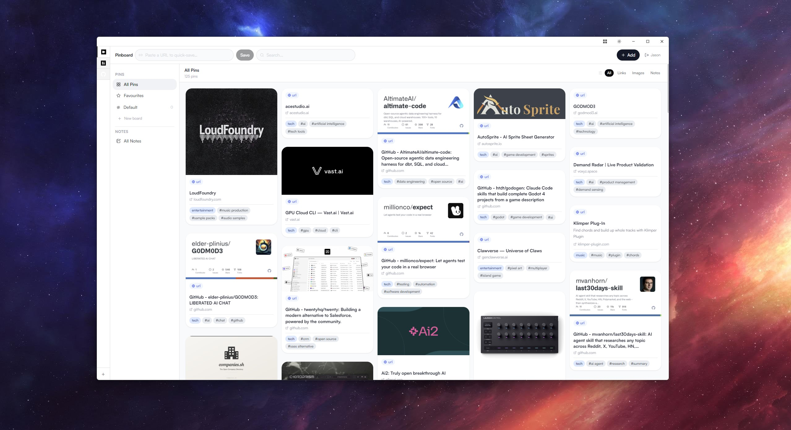

# Minimal Browser

A minimalist, allow-listed desktop browser built with Electron and TypeScript.



## Download

Download the latest release from the [releases page](https://github.com/jasontorres/minimal/download).

## Features

- **Fixed tab list**: Configure tabs in a JSON config file
- **Allow-listed navigation**: Only allow navigation within configured domains per tab
- **Simple tab UI**: Horizontal tab bar with keyboard shortcuts
- **Privacy by default**: No analytics, no remote calls except to configured sites
- **Cross-platform**: Windows, macOS, and Linux

## Installation

```bash
npm install
```

## Development

```bash
npm run dev
```

## Building

```bash
npm run build
```

## Distribution

Create installers for your platform:

```bash
# All platforms
npm run dist

# Windows only
npm run dist:win

# macOS only
npm run dist:mac

# Linux only
npm run dist:linux
```

Output will be in the `release/` directory.

## Configuration

The app stores its configuration in a platform-specific location:

- **Windows**: `%APPDATA%/minimal-browser-config`
- **macOS**: `~/Library/Application Support/minimal-browser-config`
- **Linux**: `~/.config/minimal-browser-config`

To set up initial tabs, copy `config.example.json` to that location as `config.json`.

### Example Configuration

```json
{
  "activeProfileId": "work",
  "profiles": [
    {
      "id": "work",
      "name": "Work",
      "tabs": [
        {
          "id": "github",
          "title": "GitHub",
          "url": "https://github.com",
          "allowedOrigins": ["https://github.com", "https://*.githubusercontent.com"],
          "icon": "🐙"
        },
        {
          "id": "docs",
          "title": "Documentation",
          "url": "https://docs.example.com",
          "allowedOrigins": ["https://docs.example.com", "https://api.example.com"],
          "icon": "📖"
        }
      ]
    }
  ]
}
```

### Config Options

| Field | Type | Description |
|-------|------|-------------|
| `id` | string | Unique tab identifier |
| `title` | string | Display name in tab bar |
| `url` | string | Initial URL to load |
| `allowedOrigins` | string[] | Allowed domains (supports wildcards like `https://*.example.com`) |
| `icon` | string (optional) | Emoji or icon for the tab |

## Keyboard Shortcuts

| Shortcut | Action |
|----------|--------|
| `Ctrl/Cmd+R` | Reload current tab |
| `Ctrl/Cmd+W` | Close window |
| `F11` | Toggle fullscreen |

## License

MIT
